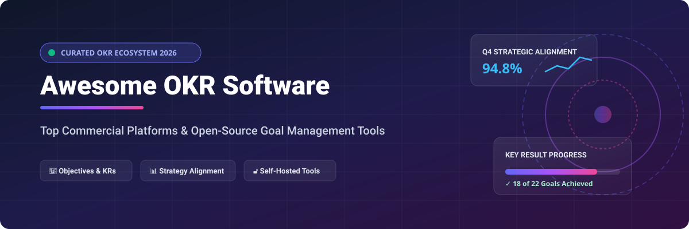

# Awesome OKR Management Software 🎯 🌟 🚀

  

  
  
  
  
  
  

---

## 🌟 Top OKR Management Software Ecosystem: Best Strategy Execution & Goal Tracking Tools 📈

**Curated List of Commercial OKR Platforms, Enterprise Strategy Tools & Open-Source Goal Management Repositories** 🎯  
*Focused on Objectives & Key Results (OKRs) Tracking, Strategic Alignment, Progress Check-Ins, Continuous Performance Management, and Self-Hosted Open-Source Alternatives* ⚙️  

**Last updated: October 2026** 📅

---

### 📌 Overview & SEO Summary 🔍
Welcome to the ultimate curated directory of **OKR management software**, **strategic goal alignment platforms**, **enterprise strategy execution suites**, and **open-source self-hosted alternatives**. Whether you are looking for leading commercial SaaS solutions or privacy-focused self-hostable open-source goal trackers, this list provides comprehensive insights into pricing, free tier limits, company scale, and GitHub community popularity. 💡

---

## 📑 Table of Contents 📖
- [🏢 SaaS & Commercial OKR Platforms](#-saas--commercial-okr-platforms)
- [🔓 Open-Source GitHub Projects & Self-Hosted Tools](#-open-source-github-projects--self-hosted-tools)
- [🛠️ How to Contribute](#%EF%B8%8F-how-to-contribute)
- [📊 Star History](#-star-history)
- [🤝 Support & Sponsorship](#-support--sponsorship)
- [⚠️ Disclaimer](#%EF%B8%8F-disclaimer)

---

## 🏢 SaaS / Commercial OKR Platforms 💼

### 📈 Market Size & Industry Structure 📊
The global OKR (Objectives & Key Results) software market size is estimated at **$2.0 Billion in 2026** and is projected to reach **$5.8 Billion by 2034**, expanding at a **CAGR of 14.2%**. The OKR software sector is **moderately fragmented**: while mega-caps like Microsoft attempt suite integration and enterprise specialists like WorkBoard consolidate mid-market players (e.g., acquiring Quantive in 2026), the market features numerous specialized point-solution vendors (Perdoo, Profit.co, Mooncamp, Weekdone) thriving across regional and SME segments without a single winner-take-all champion. 🌐

*Sorted by Company Size (Revenue / Valuation) in Descending Order* 📊

| SaaS / Commercial Platform | Company / Owner | Company Size (Revenue / Valuation) | Standard Edition Starting Price | Free Tier / Free Trial Limits | Description |
| :--- | :--- | :--- | :--- | :--- | :--- |
| **[Microsoft Viva Goals](https://www.microsoft.com/en-us/microsoft-viva/goals)** 📊 | Microsoft | ~$3.90 Trillion Valuation / $245B+ Annual Revenue | $12.00/user/month (Viva Suite annual plan) | 60-day free trial (up to 25 users); **Product retired on December 31, 2025** | **Microsoft's enterprise OKR platform** — Integrated into Microsoft Teams, Viva Suite, and Power BI analytics. **Retired end of 2025**. |
| **[Ally.io](https://www.ally.io/)** 🤝 | Microsoft (Acquired 2021) | ~$3.90 Trillion Parent Valuation / ~$100M+ Prior Valuation | $7.00/user/month (prior standalone tier) | 14-day free trial (max 10 users); merged into Viva Goals ecosystem | **Enterprise OKR tracking platform** — Acquired by Microsoft in 2021 and folded into Viva Goals. |
| **[WorkBoard](https://www.workboard.com/)** 🏢 | WorkBoard Inc. | ~$500 Million Valuation / ~$60M Annual Revenue | $20.00/user/month (Standard Business Plan) | 30-day enterprise free trial (up to 15 users); no permanent free tier | **Enterprise strategy execution & OKRs** — Built for Fortune 500 strategic alignment and quarterly outcome reviews. Acquired Quantive in 2026. |
| **[Quantive (formerly Gtmhub)](https://quantive.com/)** 📈 | Quantive (Acquired by WorkBoard) | ~$300 Million Prior Valuation / ~$35M Annual Revenue | $18.00/user/month (Growth Plan) | 14-day free trial (unlimited seats); no permanent free tier | **Strategy execution & OKR analytics** — Automated KPI integrations, whiteboards, and OKR check-ins. Acquired by WorkBoard in 2026. |
| **[Betterworks](https://www.betterworks.com/)** ⚙️ | Betterworks Systems | ~$250 Million Valuation / ~$30M Annual Revenue | $8.00/user/month (Team Plan, billed annually) | 14-day free trial (up to 10 users); implementation package required for enterprise | **Enterprise performance & OKR platform** — Combines OKR goal alignment, continuous feedback, 1-on-1s, and engagement analytics. |
| **[Leapsome](https://www.leapsome.com/)** 🚀 | Leapsome | ~$200 Million Valuation / ~$25M Annual Revenue | $8.00/user/month (Modular OKR & Goals Module) | 14-day free trial (full features); custom annual contract starting at $1,200/year | **European all-in-one people platform** — Native OKRs, performance appraisals, employee engagement, and GDPR compliance. |
| **[Profit.co](https://www.profit.co/)** 💰 | Profit Apps Inc. | ~$100 Million Valuation / ~$18M Annual Revenue | $7.00/user/month (Growth Plan, billed annually) | **Free Forever Plan up to 5 users** (basic OKR tracking & check-ins) | **AI-powered strategy execution software** — Integrates OKRs, KPIs, task management, and performance reviews in 70+ countries. |
| **[Perdoo](https://www.perdoo.com/)** 🎯 | Perdoo GmbH | ~$50 Million Valuation / ~$10M Annual Revenue | $6.00/user/month (Pro Plan, billed annually) | **Free Forever Plan up to 5 users** (full OKR & KPI tracking, Slack/Teams integrations) | **Mid-market OKR management specialist** — Strategy maps, OKR & KPI tracking, weekly check-in meetings, and expert coaching. |
| **[Weekdone](https://weekdone.com/)** 📅 | Weekdone | ~$25 Million Valuation / ~$5M Annual Revenue | $10.80/user/month (Paid Package, billed annually) | **Free Forever Plan up to 3 users**; 14-day free trial for larger teams | **Weekly check-in & OKR tool** — Automated weekly status updates, progress dashboards, team PPP (Plans, Progress, Problems) reporting. |
| **[Mooncamp](https://mooncamp.com/)** 🌙 | Mooncamp | ~$15 Million Valuation / ~$3M Annual Revenue | $8.00/user/month (Essential Plan, billed annually) | 14-day free trial (all features enabled); free migration service for Viva Goals users | **Agile visual goal tracking tool** — Combines customizable OKR frameworks, KPIs, project boards, and seamless app integrations. |

---

## 🔓 Open-Source GitHub Projects & Self-Hosted Tools 💻

*Sorted by GitHub Stars_Count (Descending)* 🌟

- **[OpenProject](https://github.com/opf/openproject)**   
  **Mature open-source project management software with OKR module**, GPL-3.0 licensed. Full OKR tracking integrated with Gantt charts, agile boards, time tracking, and work packages. Free community edition for self-hosting. 🏗️

- **[Focalboard](https://github.com/mattermost/focalboard)**   
  **Open-source project management & goal board tool**, MIT licensed. Lightweight self-hosted Trello/Notion alternative with Kanban, table, and card views for OKRs and project tracking. 📋

- **[Wekan](https://github.com/wekan/wekan)**   
  **Open-source Kanban board with goal-tracking capabilities**, MIT licensed. Self-hostable task manager featuring custom fields, swimlanes, and automated webhooks for strategic workflows. 📌

- **[Vikunja](https://github.com/go-vikunja/vikunja)**   
  **Open-source task & project management application**, AGPL-3.0 licensed. Self-hostable goal tracker with Kanban views, Gantt timelines, labels, and team collaboration features. 🚀

- **[Kanboard](https://github.com/kanboard/kanboard)**   
  **Minimalist open-source Kanban project management tool**, MIT licensed. Ultra-lightweight PHP application easily adaptable for OKR progress tracking via custom columns and plugins. ⚡

- **[Operately](https://github.com/Operately/Operately)**   
  **Open-source company operating system with built-in OKRs**, Apache-2.0 licensed. Built specifically for startup/SMB goal alignment, project check-ins, key results tracking, and team status updates. 🏢

- **[BurningOKR](https://github.com/BurningOKR/BurningOKR)**   
  **Dedicated enterprise open-source OKR platform**, Apache-2.0 licensed. Developed with Angular, Java Spring Boot, and PostgreSQL. Features multi-level organizational alignment and granular permission roles. 🔥

- **[Obsidian OKR Manager](https://github.com/jingmengzhiyue/obsidian-okr-manager)**   
  **Obsidian plugin for local-first OKR management**, MIT licensed. Visual dashboard view, check-in logging, progress bars, and zero-telemetry Markdown goal storage. 💎

- **[OKR System (Vue + Spring Boot)](https://github.com/zhouwenjun-hub/okr)**   
  **Full-stack enterprise OKR platform**, GPL-3.0 licensed. Vue 2 + Spring Boot 3.2 + MySQL architecture. Includes goal tree visualizations, department breakdown, and period archiving. 🌲

- **[OKR Server (NestJS)](https://github.com/wsuo/okr-server)**   
  **OKR & performance evaluation backend system**, MIT licensed. Built with NestJS, TypeScript, and MySQL. Features JWT authentication, role management, and evaluation templates. 🛠️

- **[okr-tracker (Oslo Kommune)](https://github.com/oslokommune/okr-tracker)**   
  **Lightweight Vue + Firebase OKR & KPI tracker**, MIT licensed. Created by Oslo Municipality for public sector product teams tracking measurable targets. 🇳🇴

- **[Brag Frog](https://github.com/gruberb/brag-frog)**   
  **Developer workflow & daily OKR check-in tool**, MIT licensed. Integrates GitHub, Jira, and Google Calendar into numeric/boolean key results with AI self-review drafts. 🐸

- **[okr2go](https://github.com/oxisto/okr2go)**   
  **Terminal-based CLI OKR tracker using Markdown files**, MIT licensed. Go binary requiring zero server setup — ideal for personal OKRs or indie hackers. 💻

---

## 🛠️ How to Contribute 🤝

Contributions are welcome! Follow these steps to submit new OKR platforms or open-source goal management software:

1. 🍴 **Fork** the repository.
2. 📝 **Add/edit** entries in `README.md` maintaining table/list structure and formatting.
3. 🔗 Include project title, official website/GitHub link, exact Stars_Count, license, and detailed description.
4. 🚀 Submit a **Pull Request** with a descriptive summary of your changes.

---

## 📊 Star History

---

## 🤝 Support & Sponsorship 💖

Thank you for visiting and supporting the **Awesome OKR Management Software** project! If you find this curated directory useful for selecting strategic goal alignment tools or open-source self-hosted alternatives, please consider supporting the project:

- ⭐ **Star** this repository to increase visibility and help others discover it!
- 🔀 **Fork** and share with fellow engineering managers, OKR coaches, and product teams.
- ☕ **Buy Me a Coffee / Sponsor**: Support ongoing maintenance and curation of open-source resources via the [GitHub Sponsor Dashboard](https://github.com/sponsors/ishandutta2007).

---

## ⚠️ Disclaimer ℹ️

- This is a **community-curated** list — not exhaustive and not an endorsement. ℹ️
- OKR platforms often contain sensitive strategic and personnel data. **Review data residency and access controls** before committing to any platform. 🔒
- Open-source OKR tools (Operately, OpenProject, BurningOKR, Obsidian OKR Manager) provide self-hosted ownership and customization freedom, but enterprise-grade SLA guarantees, dedicated coaching, and vendor support remain primarily commercial offerings. 🎯

---

  <b>Made with ❤️ for strategy leaders, OKR coaches, and open-source goal management developers.</b>

